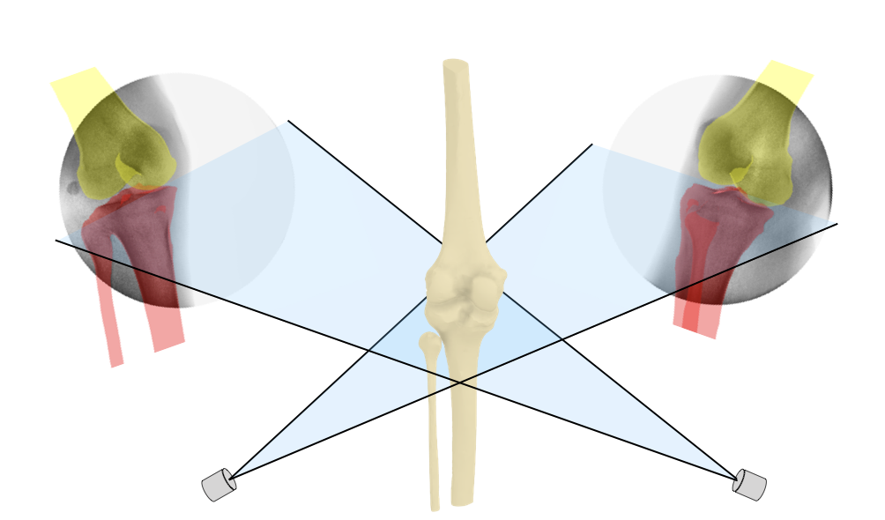
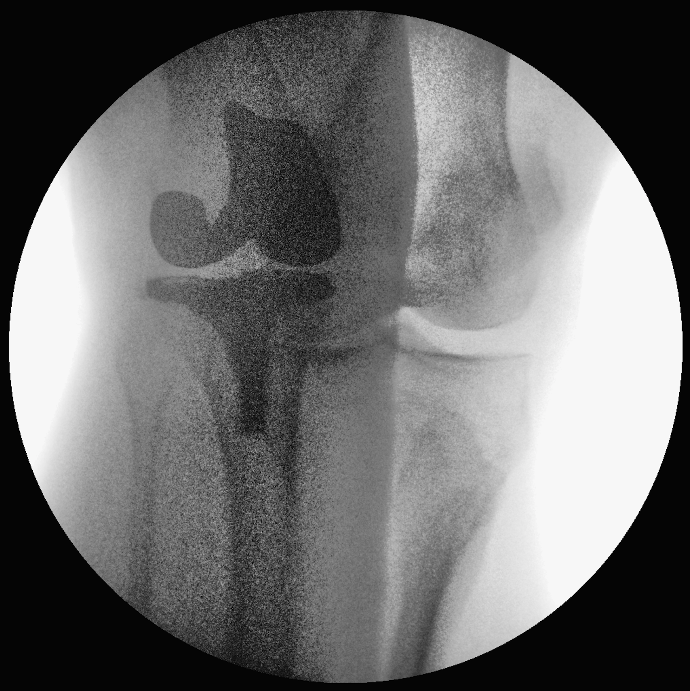
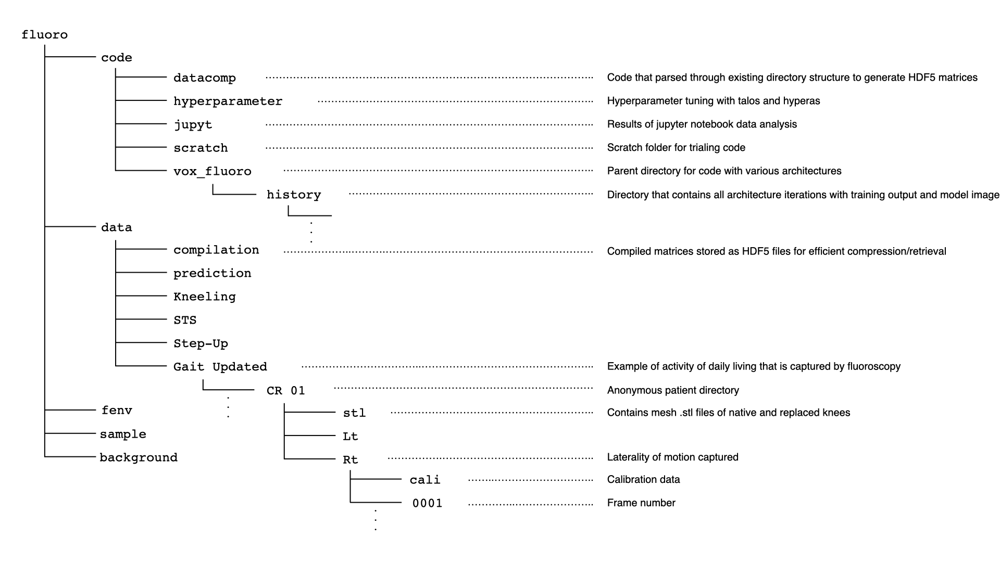
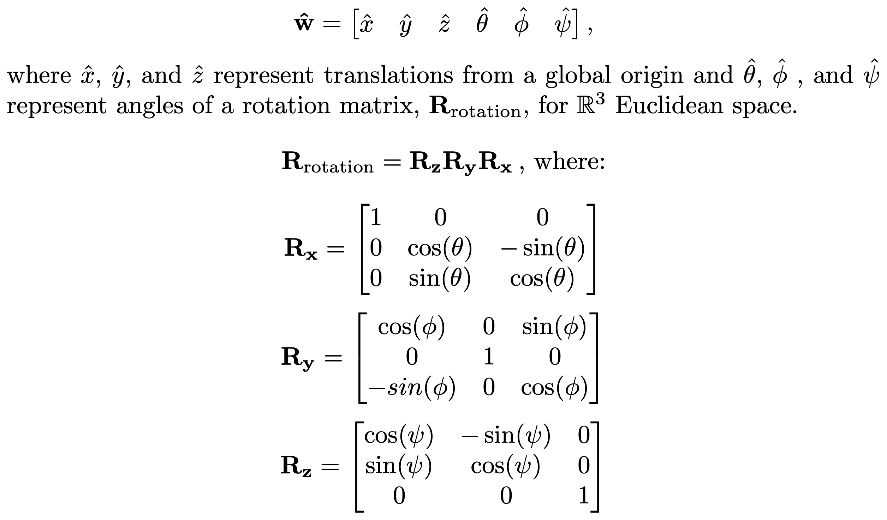
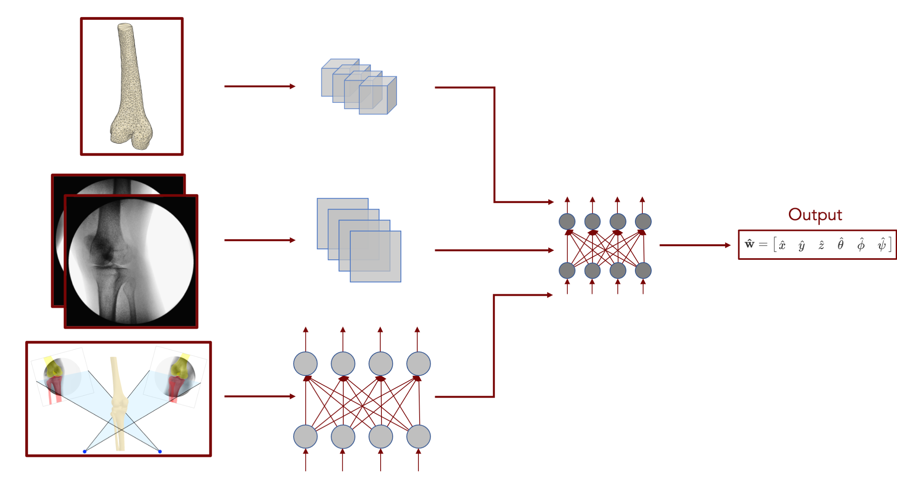
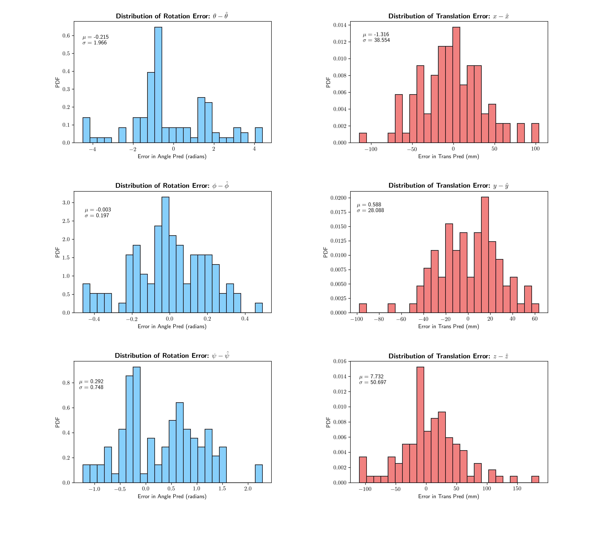
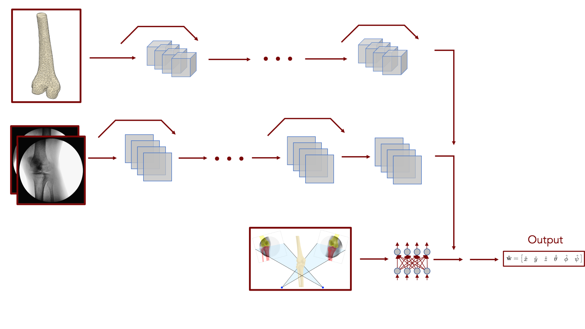
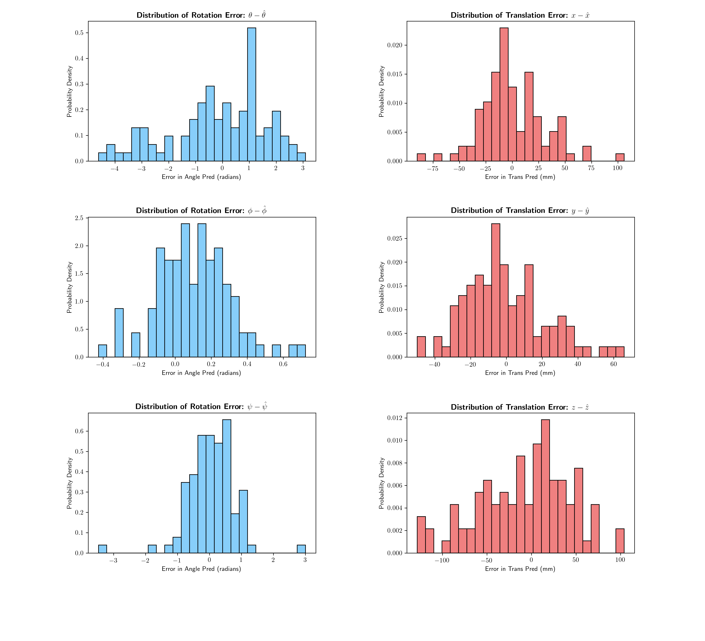
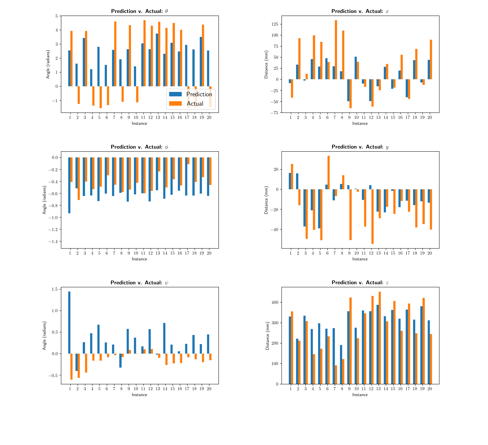
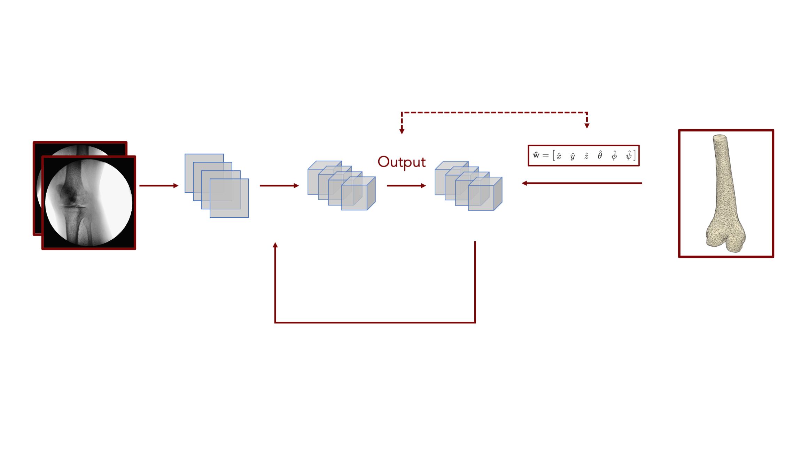

## Introduction:

This repository is a selected collection of code exploring the use of deep learning for 3D to 2D image registration. The majority of this code was written between June - September 2019, with some intermittent updates since then. 

For background, I joined the MGH Bioengineering Laboratory in November 2017. This group is primarily concerned with biomechanical and clinical evaluations of novel joint replacements. I worked on evaluating the *in vivo* kinematics of joint replacements.

To ultimately determine the relative orientation of the proximal and distal bones that define a joint, we employed various medical imaging modalities to infer *in vivo* 3D orientation. Using the knee as an example, patients would first obtain a CT scan of their intact, "native" knee. From the scan, we could generate a 3D surface mesh of the femur and tibia by first utilizing a Canny image filter for segmentation and then spline interpolation to connect the processed images across planes. From these point clusters, we could generate a surface mesh in the .stl file format. In a computer-aided design (CAD) environment, we could then mirror the point cloud of the native knee to generate a representation of the replaced knee and determine the local coordinate system for both the native and replaced knees. Patients would proceed to perform activities of daily living, such as gait and deep knee flexion, under the direct visualization of two, approximately orthogonal, fluoroscopes sampling at 30 Hz.

From the fluoroscopic images, we could generate a relationship between the point cloud of the bones on the replaced side and the CAD drawings of the replacement from the manufacturer. Knowing the geometry of the fluoroscopic setup, we next imported the acquired images from the fluoroscope with the surface meshes into a custom 3D environment in MATLAB, where we could overlay the projections of the 3D mesh onto the fluoroscopic images, thereby obtaining an *in vivo* representation of joint kinematics over time.

A difficult aspect of this process involved manually manipulating the orientation and positioning of the knee meshes in the 3D environment to overlap with the fluoroscopic images. My goal for this project was to automate this manual process. Given that our lab has been performing this manual process for years, there are thousands of example instances, which formed our training base for deep learning.

The overarching goal of the project was to create a system that could determine the spatial positioning of a bone from a global origin, given the surface mesh of the bone, two fluoroscopic images, and a few vectors detailing the geometry of the fluoroscopic system.

## Relevant Background:

The background for this project concerns image registration. I will defer a more comprehensive discussion of medical image registration, as it has previously been covered extensively. For introductions to medical image registration, I recommend a 2001 [review article](https://pubmed.ncbi.nlm.nih.gov/11277237/) by Hill et al. and a 2008 [review article](https://pubmed.ncbi.nlm.nih.gov/18270067/) by Mark Holden. Additionally, it is important to note that solving this problem has previously been attempted by previous members of our research group (see [here](https://pubmed.ncbi.nlm.nih.gov/16813450/) and [here](https://pubmed.ncbi.nlm.nih.gov/21806411/)); however, it is important to note that the practical implementation of these methods was never successful, and to this day, all frames that are utilized for publication have been manually matched. A contributing reason for the lack of success of the methods detailed above involves the presence of fluoroscopic artifacts from the contralateral knee (see image below). To determine what laterality is being evaluated in these scenarios requires knowledge of the preceding images or a binary designation of whether the knee being evaluated is or is not the replaced knee. For this reason and others, I hypothesized the problem would be better solved utilizing principles of deep learning, as has been done for other imaging modalities (see [here](https://pubmed.ncbi.nlm.nih.gov/30579222/)).

The code for the project was written in [Python 3.7](https://www.python.org/downloads/). The deep learning library utilized was [TensorFlow v2.0.0](https://www.tensorflow.org/versions/), and the code was executed on a Unix-based, private computing cluster that implemented an LSF scheduler. Training was performed on two CUDA-enabled, 16 GB [Tesla P100](https://developer.nvidia.com/cuda-gpus) GPUs from [Nvidia](https://www.nvidia.com/en-us/).

## Hierarchical Directory Structure:

Given that this project dealt with medical imaging data, it is important to note, first and foremost, that there is no direct medical imaging data contained within this repository. The repository has been scanned multiple times to ensure that any images included have been generated by me and do not contain any metadata associated with patients or the hospital of origin. Furthermore, there is no patient data contained with the Python code files. All references to the directory structure of the computational cluster have likewise been removed.

The directory structure is as follows:

It is important to note that examples of the original data directory structure have been replicated for completion, and there is no data contained in the nested directories of the given activities.

## Brief Description of Model Architecture:

The overarching goal of this project was to generate a vector detailing the global position of a specific bone. This parameter vector is of the form:

As can be seen from the description of the parameter vector, this deep learning method is attempting to predict the rigid body transformation of a given bone from the global origin. Rigid body assumptions are currently used for kinematic analysis by the MGH Bioengineering Group.

As there were thousands (~6200) of previously matched frames, the calibration data (detailing the geometry of the fluoroscopic setup), fluoroscopic data, and voxel data (generated from surface mesh in the form of a voxelized data set) were first collated into large [HDF5]( https://www.hdfgroup.org/solutions/hdf5) matrices containing the respective data, which were organized by matched frame so that an identical index across all three matrices corresponds to the same frame. These compilation matrices were first generated by code in the `fluoro/code/datacomp` directory. The training dataset was further supplemented by generating random rotations of both the voxelized dataset and the fluoroscopic images to make the trained model more robust and capable to detect higher-level relationships between the mesh data and fluoroscopic data.

The first model architecture employed 3D convolutions to the voxel dataset, 2D convolutions to the fluoroscopic dataset, and then fully connected layers on top of the calibration data. The output of these various subdivisions was then appended together to generate a fully connected layer that went into the output parameter vector.

This model had approximately 4 million tunable parameters, so after playing with various hyperparameters, it was determined that the parameter space was too large to converge to an optimal solution. An example of the output parameter vector error is shown below.

The next iterations of the network architecture employed skip connections based on the seminal 2015 [residual network paper](https://arxiv.org/abs/1512.03385) by He et al. In implementing this model, the parameter space for tuning decreased by 75% to less than 1 million parameters. 

This model iteration both converged faster and obtained a lower validation set error.

## Conclusions:

Overall, the experience demonstrated that the parameter vectors detailing the rigid body transformations of a given bone could be approximated through the use of deep learning. Although still not able to exactly replicate the manually matched parameter vectors, this study demonstrated feasibility in the method and future iterations could improve upon the results detailed above.

## Possible Next Steps:

The next iteration of the model would attempt to take the 2D fluoroscopic images and produce upsampled, voxelized models of the surface meshes, from which the 3D orientation can be inferred. This model will hopefully reduce the overfitting that occurs when there are hundreds of thousands of tunable parameters.

